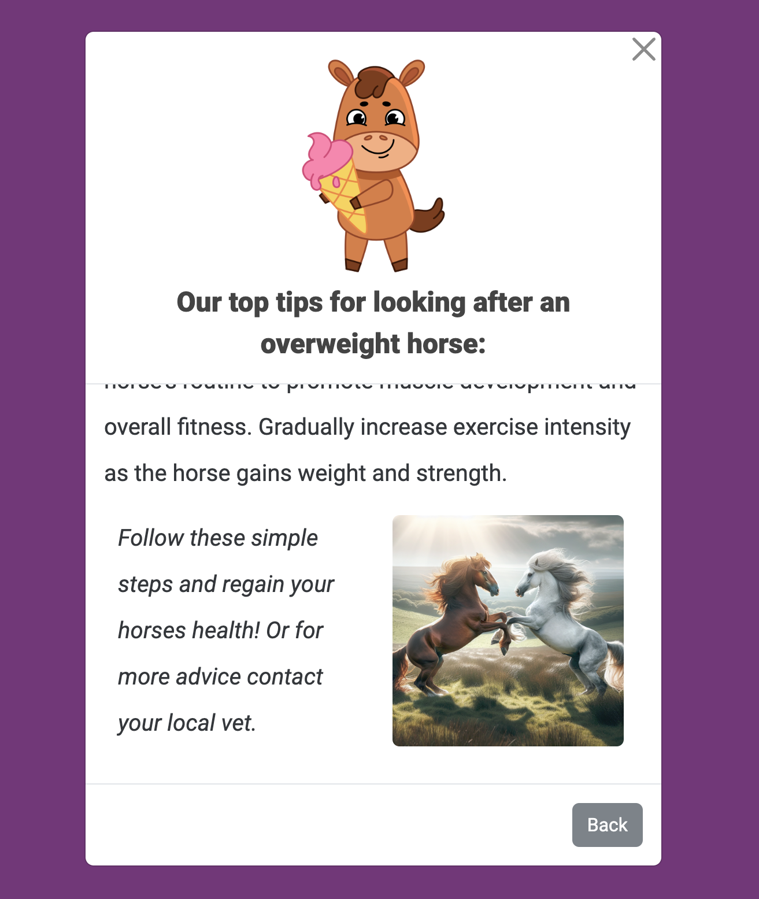

# [FIT HORSE](https://meganroberts-dev.github.io/fit_horse)

# Website Overview

At Fit Horse, we're not horsing around when it comes to your equine companion's health and fitness. Our innovative tool calculates your horse's weight with precision, providing you with valuable insights and personalized advice to keep your four-legged friend in top shape. We understand that your horse's well-being is paramount, which is why we've developed a user-friendly platform that takes the guesswork out of equine care. Whether you're a seasoned equestrian or a first-time owner, our commitment to accuracy and excellence ensures that you have the tools and knowledge to nurture a strong, vibrant bond with your horse. Join us on this journey toward optimal health and vitality for your equine partner!

GitHub now supports CALLOUTS in Markdown files.
There are some callouts already embedded in this application for you.
However, if you feel that you want to add more, there are certain ones you can use.

NOTE: the preview for callouts isn't yet supported in Gitpod/Codeanywhere/VSCode/etc.
You'll have to commit/push the changes to GitHub to see it in action.

> [!NOTE]  
> BLUE: Highlights information that users should take into account, even when skimming.

> [!TIP]  
> GREEN: Optional information to help a user be more successful.

> [!IMPORTANT]  
> PURPLE: Crucial information necessary for users to succeed.

> [!WARNING]  
> YELLOW: Critical content demanding immediate user attention due to potential risks.

> [!CAUTION]  
> RED: Negative potential consequences of an action.

Source: https://github.com/orgs/community/discussions/16925

🛑🛑🛑🛑🛑🛑🛑🛑🛑🛑-END OF NOTES (to be deleted)

source: [amiresponsive](https://ui.dev/amiresponsive?url=https://meganroberts-dev.github.io/fit_horse)

# Website Overview

At Fit Horse, we're not horsing around when it comes to your equine companion's health and fitness. Our innovative tool calculates your horse's weight with precision, providing you with valuable insights and personalized advice to keep your four-legged friend in top shape. We understand that your horse's well-being is paramount, which is why we've developed a user-friendly platform that takes the guesswork out of equine care. Whether you're a seasoned equestrian or a first-time owner, our commitment to accuracy and excellence ensures that you have the tools and knowledge to nurture a strong, vibrant bond with your horse. Join us on this journey toward optimal health and vitality for your equine partner!

## UX

The design approach aimed at seamlessly blending functionality with aesthetics. The serene grass background and inclusion of a charming cartoon horse icon, gracefully following users across each page, adds a delightful touch of personality, fostering a sense of connection and warmth. One pivotal aspect of the design process centers around the calculator, users should have the ability to effortlessly choose between different measurement units—be it inches, centimeters, or meters—to input horse measurements with ease and precision and most importanttly, have fun! Images and quotes were included to achieve this. Additonially, sections filled with informative videos and captivating images provide valuable insights and visual delights, enhancing the user journey with every interaction.

### Colour Scheme

The primary colours are white, black yellow and green. These are to match the AI generated, grass green background, which is a nice nod towards the conecpt of the site. Purple is also incorpatred in the advice section as a contrastig background colour for the modals, giving the users a different page experience.  

- `#ffffff;` used for primary containers.
- `black` used for primary text.
- `#333;` used for secondary text.
- `#ebe847;` used for primary background colour.
- `#67216c;` used for secondary background colour.
- `#5a7722;` used for button colour.

I used [coolors.co](https://coolors.co/ffffff-000000-ebe847-5a7722) to generate my colour palette.

### Typography

- [Roboto](https://fonts.google.com/specimen/Roboto) was used for all text.

- [Bootstrap Icons](https://icons.getbootstrap.com/) icons were used for inforamtion tags.

## User Stories

### New Site Users

- As a new site user, I would like to have a brief desciprtion when entering, so that I can understand what the site is about.
- As a new site user, I would like to use the calculator easily and with different measuring units, so that I can get correct results depending on my measuring tool.
- As a new site user, I would like to learn how to gather correct measurements, so that I implement it into the calculator.
- As a new site user, I would like to gain knowledge on how to imporve my horses health based on the results I recieved, so that I can become a better equestrian owner.
- As a new site user, I would like to use a restart button, incase I have multiple horses' weights to check.

### Returning Site Users

- As a returning site user, I would like to reuse the calculator with different measurments, so that I can have different results.
- As a returning site user, I would like to change the measuring units of my calculations, so that I can apply it to feeding advice.
- As a returning site user, I would like to quickly and easily access the advice I need it without having to run the calculator, so that I can use it as guide.

## Wireframes

I have created wireframes for dekstop, tablet and mobile using the devleopling tool
[Figma](https://www.figma.com/).

 | Desktop  | Tablet  | Mobile |
| :------------ |:---------------:| -----:|
|     |   | |

## Features

🛑🛑🛑🛑🛑🛑🛑🛑🛑🛑 START OF NOTES (to be deleted)

In this section, you should go over the different parts of your project,
and describe each in a sentence or so.

You will need to explain what value each of the features provides for the user,
focusing on who this website is for, what it is that they want to achieve,
and how your project is the best way to help them achieve these things.

For some/all of your features, you may choose to reference the specific project files that implement them.

IMPORTANT: Remember to always include a screenshot of each individual feature!

🛑🛑🛑🛑🛑🛑🛑🛑🛑🛑-END OF NOTES (to be deleted)

### Existing Features

- **INTERACTIVE-LANDING-PAGE-#1**

    - The landing page has an inviting aesthetic, featuring captivating elements such as an animated icon that gracefully responds to user interaction. It seamlessly integrates essential information about the site, enticing visitors to explore further. The prominent "Go" button serves as a gateway, effortlessly guiding users to the calculator, ensuring a seamless user experience.

- **INTERACTIVE-CALCULATOR**

    - The calculator boasts an engaging design with, nicely inkeeping with the animated design of the landing page. Its intuitive layout includes an information toggle, allowing users to access additional details effortlessly. Moreover, users have the flexibility to select from various measurement units, ensuring versatility and accommodating diverse preferences. The convenient "Try Again" button simplifies the process, enabling users to reset inputs swiftly and make adjustments as needed.

- **USER-RESULTS**

    - The users results shines with precision, delivering accurate weight measurements in kilograms, handling various input units. It effortlessly pairs these results with vivid images reflecting the horse's weight category. And don't forget, users can access invaluable advice through a convenient link, ensuring they have all the support they need.

- **INFORMATION-TOGGLE**

    - If users are unsure how to obtain the measurments of their horse, the information toggle feature allows for an informative YouTube video and concsise sentences, providing clear direction and interactive experience once again.

- **ADVICE-SECTION**

    - The advice section serves as a comprehensive resource hub. Delving into various weight categories, users can access detailed veterinary advice meticulously curated to address a spectrum of concerns. Complementing this expert advice are visually engaging elements, including a the sites charming icon, sporting different costumes corresponding to diverse results.

### Future Features

- INTERPERSONAL-ICON
    - In the future I would like the cartoon icon to be more interactive and move around the site acting as a guide to users. For example, I would have him waving on the landing page and clapping when the results are given. I believe this would make the site more interpersonal for users. 
- CONTACT-FORM
    - I had intended to add an email API to the advice page. At the bottom of the advice modals there would be a link where users could contact "Fit Horse" if they needed further advice on the care of their horse. I think this would a fantastic additional feature as it would build the brands emailing list and marketing potential. 
- HEADER-AND-LOGO
 - In future I would modernise the site, inclduing the "Fit Horse" style and logo. I would reach out to a proffesional brand to get this done and add it as the favicon too. 

## Tools & Technologies Used

-  used to generate README and TESTING templates.
-  used for version control. (`git add`, `git commit`, `git push`)
-  used for secure online code storage.
-  used as a cloud-based IDE for development.
-  used for the main site content.
-  used for the main site design and layout.
-  used for user interaction on the site.
-  used for hosting the deployed front-end site.
-  used as the front-end CSS framework for modern responsiveness and pre-built components.
-  used to help debug, troubleshoot, and explain things.

## Testing

> [!NOTE]  
> For all testing, please refer to the [TESTING.md](TESTING.md) file.

## Deployment

The site was deployed to GitHub Pages. The steps to deploy are as follows:

- In the [GitHub repository](https://github.com/MeganRoberts-dev/fit_horse), navigate to the Settings tab 
- From the source section drop-down menu, select the **Main** Branch, then click "Save".
- The page will be automatically refreshed with a detailed ribbon display to indicate the successful deployment.

The live link can be found [here](https://meganroberts-dev.github.io/fit_horse)

### Local Deployment

This project can be cloned or forked in order to make a local copy on your own system.

#### Cloning

You can clone the repository by following these steps:

1. Go to the [GitHub repository](https://github.com/MeganRoberts-dev/fit_horse) 
2. Locate the Code button above the list of files and click it 
3. Select if you prefer to clone using HTTPS, SSH, or GitHub CLI and click the copy button to copy the URL to your clipboard
4. Open Git Bash or Terminal
5. Change the current working directory to the one where you want the cloned directory
6. In your IDE Terminal, type the following command to clone my repository:
	- `git clone https://github.com/MeganRoberts-dev/fit_horse.git`
7. Press Enter to create your local clone.

Alternatively, if using Gitpod, you can click below to create your own workspace using this repository.

Please note that in order to directly open the project in Gitpod, you need to have the browser extension installed.
A tutorial on how to do that can be found [here](https://www.gitpod.io/docs/configure/user-settings/browser-extension).

#### Forking

By forking the GitHub Repository, we make a copy of the original repository on our GitHub account to view and/or make changes without affecting the original owner's repository.
You can fork this repository by using the following steps:

1. Log in to GitHub and locate the [GitHub Repository](https://github.com/MeganRoberts-dev/fit_horse)
2. At the top of the Repository (not top of page) just above the "Settings" Button on the menu, locate the "Fork" Button.
3. Once clicked, you should now have a copy of the original repository in your own GitHub account!

## Credits

[Dev Hub ASMR on YouTube](https://www.youtube.com/watch?v=BcLo8nuDrlg)
[Dev Hub ASMR on Github](https://github.com/devhubasmr/BMI-Calculator-With-JavaScript)
[Feb, 2024 Code Institue Hackathon Team (Love Riot)](https://github.com/MeganRoberts-dev/feb-24-hackathon-love-riot)
[Surfsup.Vector](https://www.flaticon.com/authors/surfsupvector)

### Content

| Source | Location | Notes |
| --- | --- | --- |
| [Markdown Builder](https://tim.2bn.dev/markdown-builder) | README and TESTING | tool to help generate the Markdown files |
| [StackOverflow](https://stackoverflow.com/a/2450976) | Throughout site | I would often use Stack Overflow to troubleshoot or gain understanding |
| [Programming with Mosh on YouTube](https://www.youtube.com/watch?v=W6NZfCO5SIk) | Java Script code | I would often refrences my notes from this youtube video when writing the Java Scirpt code |
| [Code Institute](https://learn.codeinstitute.net/dashboard) | Entire site| I would often refrences my notes from the learning modules  when for the entire site|

### Media

| Source | Location | Type | Notes |
| --- | --- | --- | --- |
| [AI image generator](https://www.shutterstock.com/ai-image-generator?pl=PPC_GOO_UK_AI-645775041090&cr=bc&kw=ai%20picture%20generator%20free&ds_eid=700000001391652&utm_source=GOOGLE&utm_campaign=CO%3DUK_LG%3DEN_BU%3DIMG_AD%3DAI_TS%3Dlggeneric_RG%3DEUAF_AB%3DACQ_CH%3DSEM_OG%3DCONV_PB%3DGoogle&ds_cid=71700000105247787&ds_ag=FF%3DFree_AU%3DProspecting&ds_agid=58700008250020267&utm_medium=cpc&gad_source=1&gclid=CjwKCAjwnv-vBhBdEiwABCYQA-_4OMoWvG4_JBBKrDNSQkGedCj2JkwgtnJ33nrJnu0-_xXY--ugaRoCh5sQAvD_BwE&gclsrc=aw.ds) | Entire site | AI image |
Used for background and calculator images |
| [Shutterstock AI images](https://www.shutterstock.com/search/shetland-pony-isolated) | Calulator | AI image | Shetland pony image |
| [Flaticon](https://www.flaticon.com/free-sticker/horse_10252666?term=horse&page=1&position=3&origin=tag&related_id=10252666) | Entire site| Sticker | Cartoon horse icon |
| [Youtube](https://www.youtube.com/watch?v=Xo70mDNj7b0) | Information modal | Video | Video explaining how to get measurements |
| [Bootstrap icons](https://icons.getbootstrap.com/) | Information icon | Icon | 

### Acknowledgements

- I would like to especially thank my Code Institute mentor, [Tim Nelson](https://github.com/TravelTimN) for his unwavering support, encouragment and invaluable adivce throughout the enjoyable development of this project.
- I would like to thank the [Code Institute](https://codeinstitute.net) tutor team for their assistance with troubleshooting and debugging some project issues.
- I would like to thank my brilliant Code Institue course facilitator  [Amy](https://code-institute-room.slack.com) for her kind words and inspiration. 

